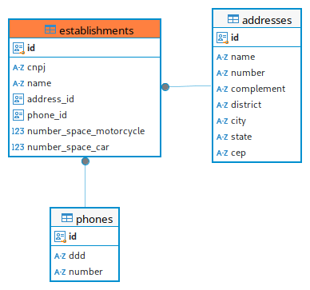
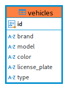
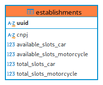
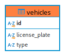
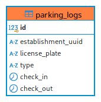

# Teste para vaga de Desenvolvedor Back-end

Teste realizado para o processo seletivo da FCamara

## Tecnologias utilizadas no Desenvolvimento do Projeto

- Java 17
- Maven
- Spring Boot
- Spring Cloud
- PostgreSQL
- MySql
- MongoDB
- RabbitMQ
- FlyWay
- JUnit 5
- Mockito
- Git
- Github Actions
- Docker
- VSCode

Somente o microsserviço de Estabelecimento foi implementado com TDD (Foi implementado testes unitários e de integração).

### A fazer:

- Configurar o Spring Hateoas e o Swagger;
- Implementar o microsserviço de Autenticação;
- Criar API de relatório;
  - Sumário da quantidade de entrada e saída;
  - Sumário da quantidade de entrada e saída de veículos por hora;
- Implementar o Front-end;

## Executar o Projeto

### Ferramentas Instaladas Necessárias:

- Git (https://git-scm.com/downloads)
- Docker (https://www.docker.com/products/docker-desktop/)

### Passo a Passo para Execuatar o Projeto

1. Abra o terminal e execute o seguinte comando

```
git clone https://github.com/hcbtechsolution/backend-test-fcamara.git
```

2. Entre no diretório backend-test-fcamara\parking-lots-management

```
cd backend-test-fcamara\parking-lots-management
```

3. Abra o explorer com o seguinte comando

```
explorer .
```

4. Crie um arquivo .env com as seguintes variaveis de ambientes abaixo e defina os valores para cada um e salve.

```
EUREKA_USER=
EUREKA_PASSWORD=
MONGODB_USER=
MONGODB_PASSWORD=
MYSQL_ROOT_PASSWORD=
MYSQL_USER=
MYSQL_PASSWORD=
POSTGRES_USER=
POSTGRES_PASSWORD=
RABBITMQ_USER=
RABBITMQ_PASS=
```

5. De volta ao terminal, execute comando abaixo para subir a aplicação e aguarde o docker subir toda estrutura e os microsserviços (Na primeira vez, pode demorar alguns minutos para baixar as imagens docker).

```
docker compose up -d
```

### Endpoints disponiveis

#### Estabelecimento

```
POST /establishments

{
  "cnpj": "",
  "name": "",
  "address": {
    "name": "",
    "number": "",
    "complement": "",
    "district": "",
    "city": "",
    "state": "",
    "cep": ""
  },
  "phone": {
    "ddd": "",
    "number": ""
  },
  "numberSpaceMotorcycle": ,
  "numberSpaceCar":
}

PUT /establishments/{id}

{
  "cnpj": "",
  "name": "",
  "address": {
    "name": "",
    "number": "",
    "complement": "",
    "district": "",
    "city": "",
    "state": "",
    "cep": ""
  },
  "phone": {
    "ddd": "",
    "number": ""
  },
  "numberSpaceMotorcycle": ,
  "numberSpaceCar":
}

GET /establishments

GET /establishments/{id}

DELETE /establishments/{id}
```

#### Veículo

```
POST /vehicles

{
  "brand": "",
  "model": "",
  "color": "",
  "licensePlate": "",
  "type": ""
}

PUT /vehicles/{id}

{
  "brand": "",
  "model": "",
  "color": "",
  "licensePlate": "",
  "type": ""
}

GET /vehicles

GET /vehicles/{id}

DELETE /vehicles/{id}
```

#### Veículo

```
POST /parking-control/checkin

{
  "establishmentId": "",
  "licensePlate": ""
}

PUT /parking-control/checkout/{id}

{
  "establishmentId": "",
  "licensePlate": ""
}
```

## Especificação

Criar uma API REST para gerenciar um estacionamento de carros e motos. O retorno deverá ser em formato JSON e XML;

### Funcionalidades

- **Estabelecimento:** CRUD;
- **Veículos:** CRUD;
- **Controle de entrada e saída de veículos.**

### Requisitos:

#### 1. Cadastro de estabelecimento

Criar um cadastro da empresa com os seguintes campos:

- Nome;
- CNPJ;
- Endereço;
- Telefone;
- Quantidade de vagas para motos;
- Quantidade de vagas para carros.

**Todos** os campos são de preenchimento obrigatório.

#### 2. Cadastro de veículos

Criar um cadastro de veículos com os seguintes campos:

- Marca;
- Modelo;
- Cor;
- Placa;
- Tipo.

**Todos** os campos são de preenchimento obrigatório.

#### 3. Modelagem de dados

##### 3.1 Microsserviço de Estabelecimento



##### 3.2 Microsserviço de Veículo



##### 3.3 Microsserviço de Controle do Estacionamento






